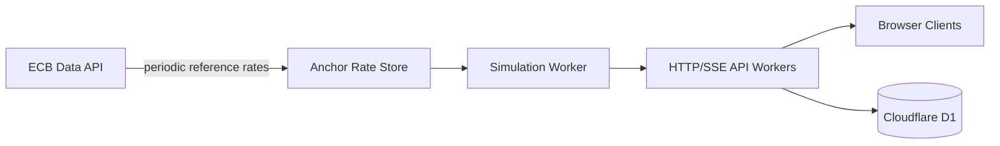

# Aster Forex Simulator

A Vinext/Sites web app for simulated multi-user FOREX trading. The app uses
ECB daily reference rates as immutable anchor observations and clearly labels
all generated intraday ticks as simulated market data.

## Architecture



The current Sites MVP runs on the existing Vinext + React + Cloudflare Worker
stack. It uses:

- `app/` for UI and API routes.
- `lib/forex/` for ECB parsing, cross-rate derivation, deterministic
  simulation, decimal helpers, portfolio accounting, and D1 repository logic.
- `db/schema.ts` and `drizzle/0000_forex_simulator.sql` for D1 tables.
- Workspace-authenticated user headers, falling back to
  `local-demo@example.test` only outside production.

## Market Data Model

ECB endpoint:

```text
https://data-api.ecb.europa.eu/service/data/EXR/D.USD+GBP+JPY+CHF.EUR.SP00.A?lastNObservations=1&format=csvdata
```

Stored anchors preserve the original ECB values as strings:

- currency
- rate
- observation date
- retrieval timestamp
- source

Generated prices are separate simulator quotes with `source: "simulated"`.

Attribution: Source of daily reference rates: ECB statistics.

## Local Setup

```bash
npm install
npm run dev
```

Build:

```bash
npm run build
```

Focused tests:

```bash
npm run test:forex
```

Lint:

```bash
npm run lint
```

## CI/CD

GitHub Actions workflow:

```text
.github/workflows/trading-terminal-site.yml
```

The workflow runs on changes to `trading-terminal-site/`, validates the app with
lint, focused FOREX tests, and `npm run build`, then uploads the generated Sites
artifact. Pushes to `master` also create a GitHub production environment record
for:

```text
https://aster-trading-terminal.yope-1704.chatgpt-team.site/
```

The live site is the existing OpenAI Sites project:

```text
appgprj_6a273edca0788191b65b1ab1d1373183
```

OpenAI Sites deployment credentials are managed by the Sites connector rather
than committed repo secrets.

## D1 Migration

The app declares the logical D1 binding in `.openai/hosting.json`:

```json
{
  "d1": "DB"
}
```

Apply `drizzle/0000_forex_simulator.sql` to the bound D1 database before using
account, order, position, or trade APIs.

## Environment Variables

Safe local defaults exist for all settings.

```text
ECB_API_BASE_URL
ECB_REFRESH_INTERVAL_SECONDS
FOREX_TICK_INTERVAL_MS
FOREX_RANDOM_SEED
FOREX_ANCHOR_MEAN_REVERSION
FOREX_VOLATILITY_MULTIPLIER
FOREX_MAX_SYMBOLS_PER_CONNECTION
FOREX_DEFAULT_STARTING_BALANCE
FOREX_ALLOW_SHORT_SELLING
FOREX_ANCHOR_STALE_AFTER_SECONDS
```

## API

Market data:

```text
GET /api/v1/forex/instruments
GET /api/v1/forex/prices
GET /api/v1/forex/prices/EUR%2FUSD
GET /api/v1/forex/market-status
GET /api/v1/forex/stream?symbols=EUR%2FUSD,GBP%2FUSD
```

Trading:

```text
POST /api/v1/orders
GET /api/v1/orders
GET /api/v1/orders/{order_id}
GET /api/v1/positions
GET /api/v1/trades
GET /api/v1/account
```

Sample order:

```bash
curl -X POST http://localhost:3000/api/v1/orders \
  -H 'Content-Type: application/json' \
  -d '{
    "symbol": "EUR/USD",
    "side": "buy",
    "quantity": "1000",
    "order_type": "market",
    "client_order_id": "demo-1"
  }'
```

Sample stream client:

```js
const source = new EventSource("/api/v1/forex/stream?symbols=EUR%2FUSD,USD%2FJPY");
source.addEventListener("snapshot", event => console.log(JSON.parse(event.data)));
source.addEventListener("tick", event => console.log(JSON.parse(event.data)));
source.addEventListener("heartbeat", event => console.log(JSON.parse(event.data)));
```

## Accounting Rules

- Starting cash: 100,000 USD by default.
- Leverage: disabled.
- Short selling: disabled unless `FOREX_ALLOW_SHORT_SELLING=true`.
- Market buys execute at ask.
- Market sells execute at bid.
- Long unrealized P&L uses current bid.
- Short unrealized P&L uses current ask.
- Quantity, cash, P&L, and persisted prices use decimal strings.
- Account updates use optimistic version checks to reject concurrent updates.

## Disclaimer

Simulated market data. Daily reference-rate anchors are based on ECB statistics.
Prices shown between daily anchors are generated by the simulator and are not
live or tradable market quotations. This product does not provide investment
advice.

## Production Notes

The MVP keeps the simulation model isolated so it can later be replaced by a
licensed data provider. For horizontally scaled production, run the simulation
as a dedicated worker and distribute ticks through Redis pub/sub or an
equivalent shared transport. The current Sites implementation exposes the
real-time contract over SSE because this project does not have an existing
WebSocket/Redis worker runtime. `/api/v1/ws/ticket` is present for the intended
short-lived ticket flow, but full WebSocket upgrade handling and Redis-backed
fanout remain production follow-up work.
